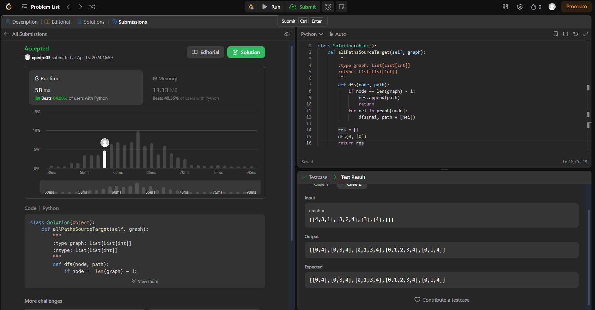
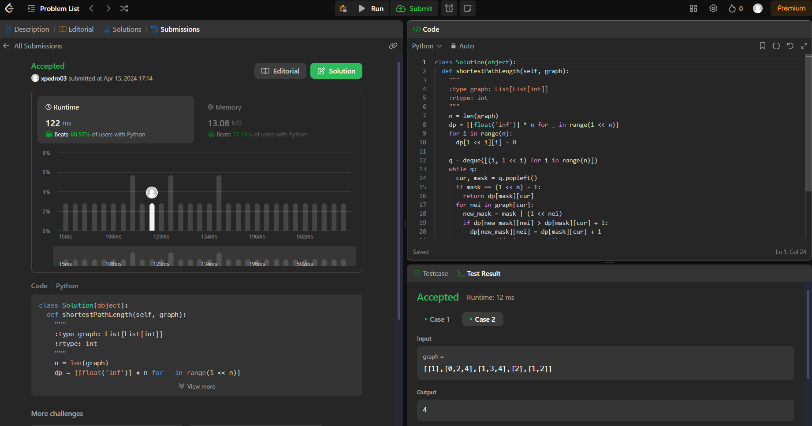
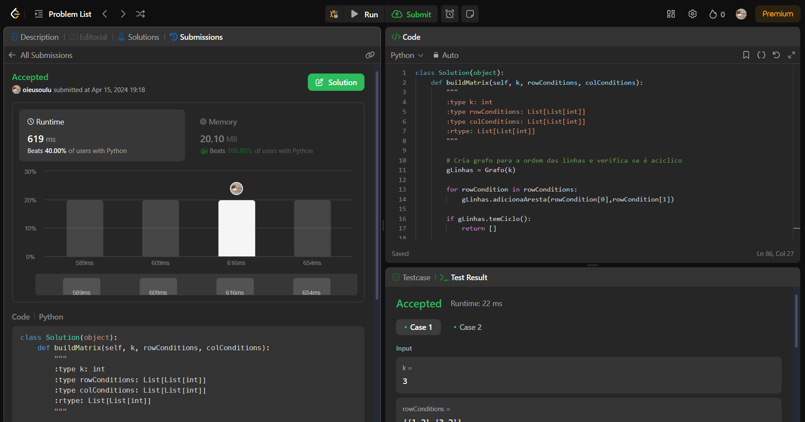

# LeetJudge

**Número da Lista**: 10 
**Conteúdo da Disciplina**: Grafos 1 

## Alunos
| Matrícula  | Aluno                           |
| ---------- | ------------------------------- |
| 22/1007653 | Luciano Ricardo da Silva Junior |
| 21/1031468 | Pedro Victor Salerno Martins    |

## Sobre 
Resolver duas questões dificeis e uma media utilizando os conceitos de grafos aprendidos na disciplina de Projetos de Algoritimos da Universidade de Brasilia.

## Screenshots

**Questão 797 após submição**

**Questão 847 após submição**

**Questão 2392 após submição**

## Instalação

**Linguagem**: Python 
**Framework**: Não tem 

## Uso

Você pode apenas entrar na questão especifica do juiz virtual e fazer a submição.

As questões são:

- [Questão 797](https://leetcode.com/problems/all-paths-from-source-to-target/description/)
- [Questão 847](https://leetcode.com/problems/shortest-path-visiting-all-nodes/description/)
- [Questão 2392](https://leetcode.com/problems/build-a-matrix-with-conditions/)

Alternativamente você pode ter o Python instalado e executar os arquivos de teste.